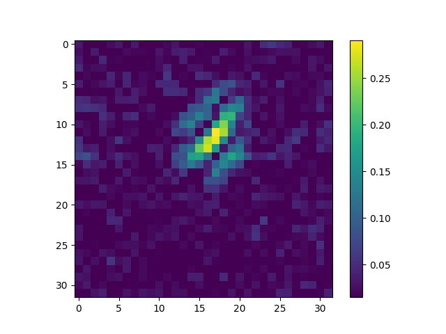

# Soft Convolutional Neural Networks

## Overview
This repository provides code and resources associated with our paper titled _Soft CNNs_. We study an interpolated architecture which intuitively lies between an MLP and a classical CNN on the spectrum of inductive bias. In particular, we depart from the traditional sparsity assumption inherent in CNNs while preserving their weight sharing. 

## Explore
WM aims to simulate weight sharing while retaining flexibility. It introduces a novel architecture departing from the traditional locality assumption while retaining the element of weight sharing. It is structured as a (Mix-)block, generating vectors for each input channel and aggregating output channels for further processing. Evaluation on CIFAR and Tiny ImageNet datasets showcases WM's intermediate performance between MLPs and CNNs. Post-training, WM learns to emphasize locality, resembling CNN inductive bias. 

